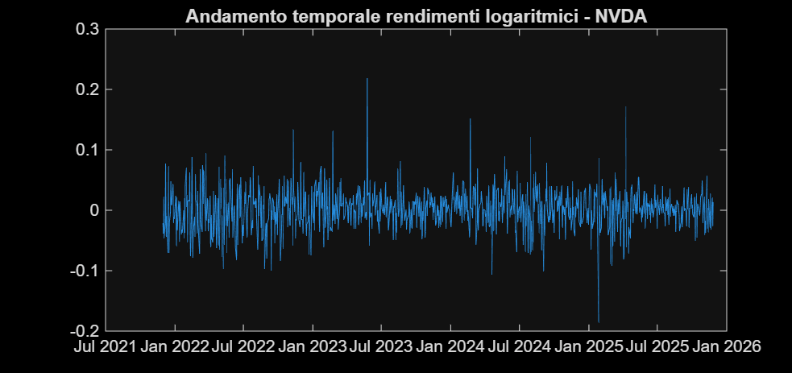
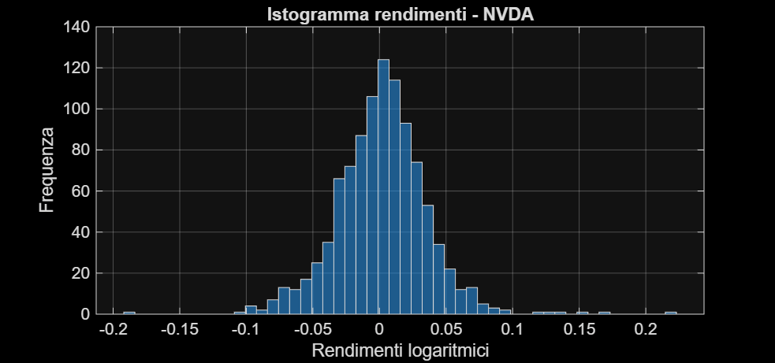
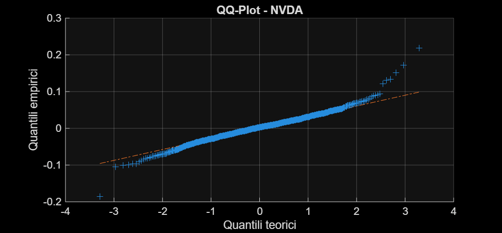
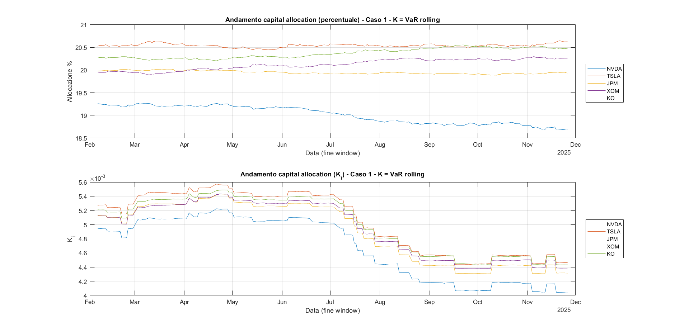
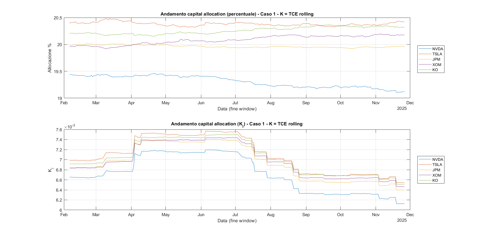
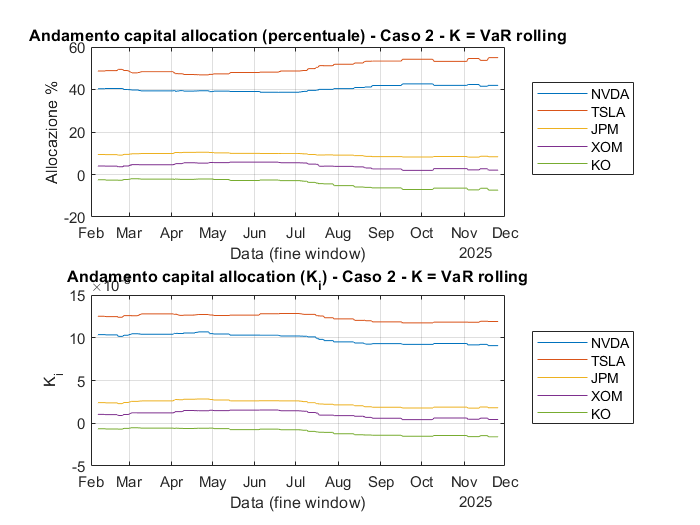
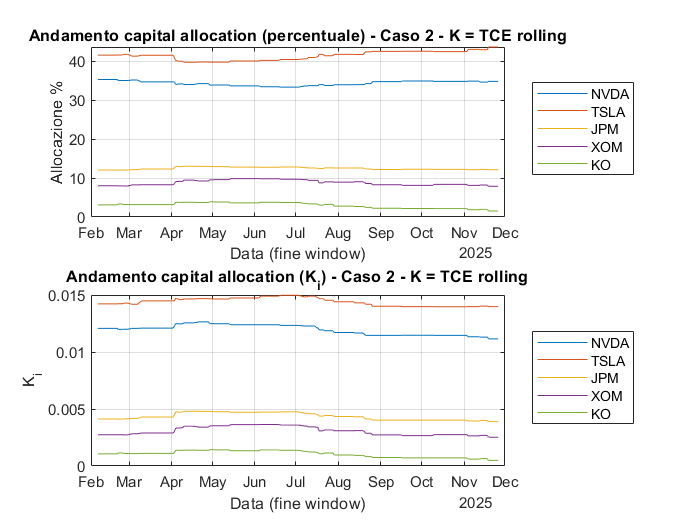
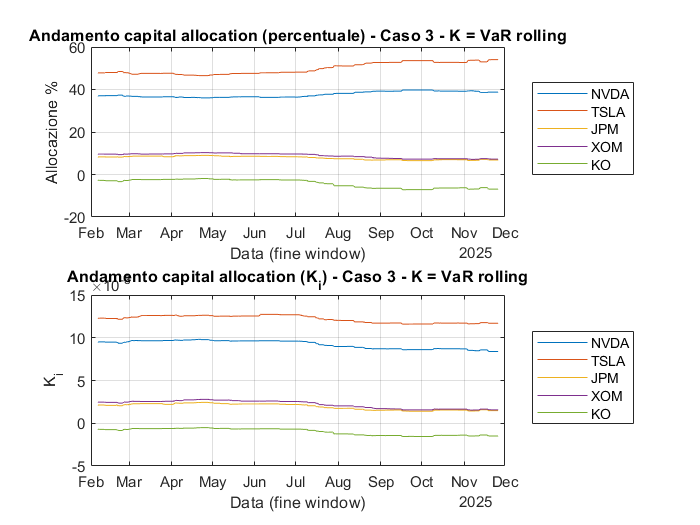
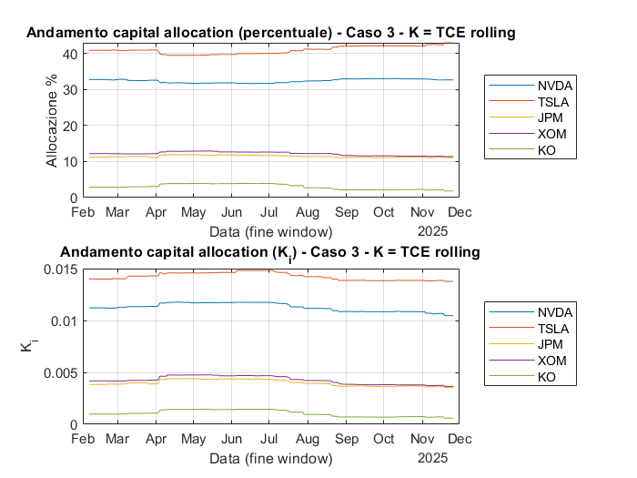

# Optimal Capital Allocation — VaR, TCE & Rolling Tail-Risk Attribution

University group coursework for **Risk Measures** at the University of Milano-Bicocca, implemented in MATLAB. The project studies the capital-allocation framework developed in *Optimal Capital Allocation Principles* and applies it to a five-stock portfolio using empirical VaR and Tail Conditional Expectation (TCE).

The original coursework was completed by **Ernesto Michele Ruschena, Alberto Preti, Simone D'Isabella and Gianluca De Pieri**. This public repository preserves the submitted MATLAB source and report outputs while excluding the raw third-party market-data workbook and the full submitted report.

## Research question

Given an aggregate portfolio capital requirement, how does the allocation across individual risk units change when the weighting variable places progressively more emphasis on portfolio-level or asset-level tail events?

The empirical implementation treats five equities — **NVDA, TSLA, JPM, XOM and KO** — as the analogue of business units and compares three quadratic-allocation cases under both VaR and TCE capital requirements.

## Methodology

The script first restricts the dataset to the last four years available, forward-fills missing observations and computes daily log returns. It then estimates descriptive statistics and empirical 5% tail-risk measures before constructing an equal-weight portfolio.

The quadratic allocation rule is implemented under three choices of the state-weighting variable:

1. **Case 1 — benchmark (`ζ_i ≡ 1`)**: no tail-state reweighting; allocation is close to proportional across the equal-weight exposures.
2. **Case 2 — aggregate-portfolio driven**: observations receive weight when the **portfolio** return is in its left tail, making the allocation sensitive to systematic tail states.
3. **Case 3 — business-unit driven**: each asset is weighted according to its **own** left-tail event, emphasising idiosyncratic tail behaviour.

For each case, the code checks full allocation and reports both absolute `K_i` and percentage capital contributions under **VaR** and **TCE**.

## Rolling analysis

A second stage applies the same three allocation schemes on an **800-observation rolling window**. The conditional means entering the allocation are blended as

`60% × full-sample estimate + 40% × current-window estimate`.

The six rolling figures below show every combination of allocation case and risk measure included in the submitted report. Each MATLAB figure contains both percentage allocations and absolute `K_i` allocations through time.

> **Interpretation note.** Because the rolling calculation uses full-sample quantities in the 60% global component, this is best viewed as a **retrospective rolling attribution / stability analysis**, not a strict walk-forward out-of-sample backtest.

> **Reproducibility note.** With the workbook contained in the coursework package, the current script's four-year filter produces 1,004 log-return observations and therefore **205** windows of length 800 (`T - window + 1`). The submitted report text states **204** windows. The repository preserves the submitted source and submitted figures rather than silently altering either side of that discrepancy.

## Submitted results

The report finds an equal-weight portfolio 5% VaR of approximately **2.565%** and 5% TCE of approximately **3.518%**, below the corresponding tail-risk levels of the most volatile individual holdings.

The allocation becomes materially more concentrated once tail states are introduced. In the submitted static results:

- **Case 1** remains close to a 20% allocation per asset.
- **Case 2** assigns roughly **39.7% / 49.4%** of VaR capital to NVDA / TSLA.
- **Case 3** assigns roughly **36.6% / 48.2%** of VaR capital to NVDA / TSLA.
- KO receives a small **negative VaR allocation** in Cases 2 and 3; this is permitted by the unconstrained `K_i` formula and is interpreted as a diversification contribution rather than an implementation error.

The complete submitted Tables 2–7 are transcribed in [`results/submitted_static_allocations.csv`](results/submitted_static_allocations.csv).

## Exact submitted MATLAB output gallery

The images below are extracted directly from the submitted report. They are **not reconstructed, smoothed or restyled**.

### Representative single-asset diagnostics — NVDA

<table>
<tr>
<td width="50%" valign="top"><strong>Log-return time series</strong><br></td>
<td width="50%" valign="top"><strong>Return histogram</strong><br></td>
</tr>
</table>

<p align="center"><strong>Normal QQ-plot</strong><br></p>

The diagnostics illustrate volatility clustering, outliers and departures from Gaussian tails; the submitted report relates these features to the gap between TCE and VaR for the riskier holdings.

### Case 1 — benchmark allocation

<table>
<tr>
<td width="50%" valign="top"><strong>Rolling VaR allocation</strong><br></td>
<td width="50%" valign="top"><strong>Rolling TCE allocation</strong><br></td>
</tr>
</table>

### Case 2 — aggregate-portfolio tail allocation

<table>
<tr>
<td width="50%" valign="top"><strong>Rolling VaR allocation</strong><br></td>
<td width="50%" valign="top"><strong>Rolling TCE allocation</strong><br></td>
</tr>
</table>

### Case 3 — asset-level tail allocation

<table>
<tr>
<td width="50%" valign="top"><strong>Rolling VaR allocation</strong><br></td>
<td width="50%" valign="top"><strong>Rolling TCE allocation</strong><br></td>
</tr>
</table>

## Repository structure

```text
.
├── matlab/
│   └── codice_risk_measures_VaR_TCE.m
├── data/
│   └── README.md
├── figures/
│   ├── 01_nvda_log_returns.png
│   ├── 02_nvda_histogram.png
│   ├── 03_nvda_qqplot.png
│   ├── 04_case1_var_rolling.png
│   ├── 05_case1_tce_rolling.png
│   ├── 06_case2_var_rolling.png
│   ├── 07_case2_tce_rolling.png
│   ├── 08_case3_var_rolling.png
│   ├── 09_case3_tce_rolling.png
│   └── README.md
├── results/
│   ├── submitted_static_allocations.csv
│   └── README.md
├── .gitignore
└── README.md
```

## Reproducibility and data policy

The MATLAB source is preserved under its submitted filename. It expects `Dataset_risk_measure.xlsx`, worksheet `Sheet1`, and uses functions from base MATLAB / Statistics and Machine Learning functionality such as `quantile`, `skewness`, `kurtosis` and `qqplot`.

The original workbook is **not redistributed** because it contains third-party market-price data supplied for coursework. The full PDF report is also omitted from the public repository; only the analytical output figures and explicitly transcribed result tables needed to understand the project are included.

## Implementation notes

- Tail risk is measured empirically at the **5% left tail** of log returns and reported as a positive loss magnitude.
- The equal-weight portfolio uses `1/n` weights across the five equities.
- The code explicitly checks the **full-allocation property** for each static and rolling case.
- Negative `K_i` values are possible because no non-negativity constraint is imposed on capital allocations.
- The rolling 60/40 global-window blend is a stabilisation device chosen in the coursework; it should not be interpreted as a leakage-free forecasting design.

## Reference

- Dhaene et al. (2012), *Optimal Capital Allocation Principles* — theoretical framework summarised and implemented in the submitted coursework.

## Authorship

The original coursework was completed by **Ernesto Michele Ruschena, Alberto Preti, Simone D'Isabella and Gianluca De Pieri**. Publication under this GitHub account reflects portfolio curation of a group assignment and does **not** imply sole authorship.

## Scope disclaimer

This repository documents university coursework and historical empirical analysis. It is not investment advice or a production risk-management system.
